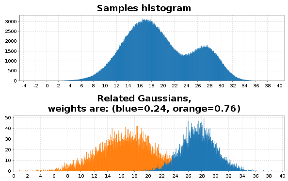
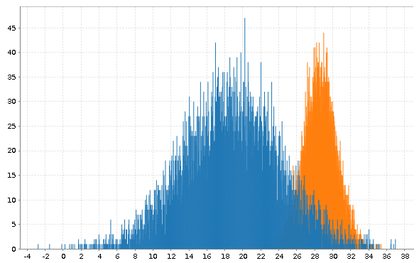

# Expectatoin-Maximization
Simple implementation of EM algorithm for one dimensional Gaussian mixtures using `breeze` and `scala`.

# Prerequisites 
- sbt 0.13+
- java

# How to run
- clone repo
- change directory to project root
- run `sbt` to get sbt console
- in sbt console `> run`
- see the results

# Sample output
Sample data and its related Gaussians.

Steps of EM algorithm.

**Weights**:

blue = 0.7620660347548759

orange=0.2379339652451241

**Gaussians**:

mean=16.97737328752034,  var=4.122184758891788   

mean=27.516826908426882, var=2.4536040220003836  
